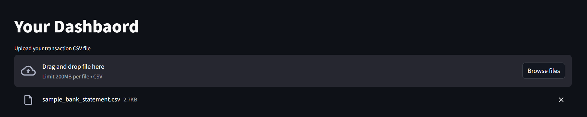

# Personal Finance Automation Tool

This project is a **personal finance automation tool** built with **Python**, **Pandas**, **Streamlit**, and **Plotly**.  
It helps users easily **analyze**, **visualize**, and **track** their income and expenses by uploading simple CSV files — converted from their own banking statements.

---

## ✨ Features
- Upload your banking transaction data (CSV format)
- Automatic categorization of income and expenses
- Interactive charts and graphs with **Plotly**
- Clean and easy-to-use web interface powered by **Streamlit**
- Supports basic data cleaning and transformation
- Privacy-first — you control your data (use local files)

---

## 📁 Data Format
The tool expects a CSV file with the following columns:

| Column Name   | Description                       |
|---------------|-----------------------------------|
| Date          | Transaction date (DD/MM/YYYY)     |
| Details       | Description of the transaction    |
| Amount        | Transaction amount (positive/negative) |
| Currency      | Currency code (e.g., USD, EUR)     |
| Debit/Credit  | Indicates whether it's a Debit or Credit |
| Status        | Status of the transaction (e.g., Completed, Pending) |

> **Note:** You can export your transaction history from your banking app and make minor adjustments to match this format. Dummy data is used in this project for demonstration and privacy reasons.

---

## 🚀 Installation

1. **Clone the repository**  
```bash
git clone https://github.com/shubh4mk/Personal-Finance-Automation-Tool.git
cd finance-automation-tool
```

2. **Install dependencies**  
```bash
pip install -r requirements.txt
```

3. **Run the app**  
```bash
streamlit run app.py
```

---

## 🛠️ Tech Stack
- **Python**: Core scripting
- **Pandas**: Data handling and preprocessing
- **Streamlit**: Web app development
- **Plotly**: Interactive visualizations

---

## 📊 Screenshots
1. Upload Data  


---

2. Add Categories  


---

3. Expenses Overview  


---

4. Categories Added  


---

5. Graphs and Visualizations  


---

## 🔒 Privacy & Security
- Your financial data remains local to your machine.
- No data is sent or stored externally.
- Dummy datasets are used for demos and testing.

---

## ✍️ Future Improvements
- Add automatic categorization using machine learning
- Monthly and yearly summary reports
- Export visual reports to PDF
- Budget planning and savings goals tracking

---

## 🤝 Contributions
Pull requests and feature suggestions are welcome!

---